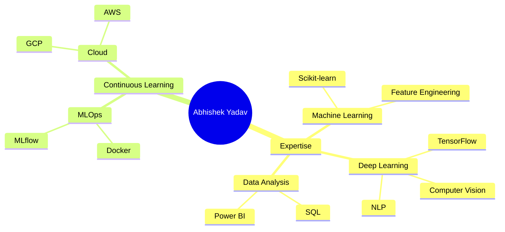

<div align="center">

# 👋 Hi, I'm Abhishek Yadav


[](https://git.io/typing-svg)

</div>

<p align="center">
  
  
  
</p>

<div align="center">
  
### 🎓 B.Tech in Computer Science (Artificial Intelligence & Machine Learning)
**Mckv Institute of Engineering**

💡 **Aspiring Data Scientist** | Passionate about **Data Analytics, Machine Learning & Problem-Solving**  


[](https://www.linkedin.com/in/abhisheek4268)
[](https://github.com/Abhisheek34)

</div>

---

## 🚀 About Me

```python
class DataScientist:
    def __init__(self):
        self.name = "Abhishek Kumar Yadav"
        self.role = "Data Scientist & ML Engineer"
        self.education = "B.Tech in AI & Machine Learning"
        self.language_spoken = ["Hindi", "English"]
        
    def current_work(self):
        return [
            "👥 Customer Churn Analysis - MySQL & Power BI",
            "💸 CurrenSee - AI-Powered Indian Currency Recognition",
            "🛒 Amazon Fine Food Review - Sentiment Analysis"
        ]
    
    def skills(self):
        return {
            "languages": ["Python", "SQL"],
            "ml_frameworks": ["Scikit-learn", "TensorFlow", "Keras", "NLTK", "MLflow"],
            "data_tools": ["Pandas", "NumPy", "Matplotlib", "Seaborn", "Power BI"],
            "tools": ["Git", "GitHub", "VS Code", "Streamlit", "Docker"]
        }
    
    def goals_2026(self):
        return "Building impactful AI projects and mastering MLOps pipelines."

me = DataScientist()
print(me.goals_2025())
```

<details>
<summary>📊 More About Me (Click to expand)</summary>


- 🔭 **Featured Projects:**
  - 💸 **CurrenSee** - AI-powered Indian Currency Recognition using EfficientNetB0 (94.6% Accuracy).
  - 👥 **Customer Churn Analysis** - End-to-end data pipeline using MySQL and Power BI.
  - 🛒 **Sentiment Analysis** - Processing 100k+ Amazon fine food reviews using NLTK.

- 🌱 **Currently Learning:**
  - 🚀 **MLOps** - Mastering model versioning with MLflow and containerization with Docker.
  - ☁️ **Cloud Deployment** - Learning to scale AI apps on Google Cloud and AWS.
  - 🧬 **Advanced NLP** - Exploring Transformers and large language model fine-tuning.

- 🎯 **2026 Goals:**
  - Master Production-Grade ML Pipelines (MLOps).
  - Build 10+ Production-Ready ML Projects.
  - Contribute to Open Source AI Projects.
  - Secure a Data Science role in a leading tech firm.

- ⚡ **Fun Fact:** I love turning complex data into simple, actionable insights!

</details>

---

## 🛠️ Tech Stack & Skills

<div align="center">

### 💻 Programming Languages


### 📊 Data Science & ML


### 📈 Data Visualization


### 🔧 Tools & Platforms


</div>


---


## 📊 GitHub Statistics

<div align="center">


### 🏆 GitHub Trophies
[](https://github.com/ryo-ma/github-profile-trophy)

</div>

---

## 🎖️ Achievements & Certifications

- 🎓 **Machine Learning Specialization** - Coursera | [View Certificate](https://coursera.org/share/890fd2564ae12be18c8536a9e8d63b6c)
- 🎓 **Deep Learning Specialization** - Coursera | [View Certificate](https://coursera.org/share/cde326f94e48659212e191108c012b37)
- 🎓 **Complete Data Science,Machine Learning,DL,NLP Bootcamp** - Udemy | [View Certificate](https://drive.google.com/file/d/1SDNoiaOUb2x5mJSgXsoXMGLJNu1Yk2Lb/view)

---

## 📈 Contribution Graph

<div align="center">

[](https://github.com/Abhisheek34/github-readme-activity-graph)

</div>

---

## 🎯 What I'm Up To




---

## 🤝 Connect With Me

<div align="center">

### Let's Build Something Amazing Together! 🚀

<a href="https://www.linkedin.com/in/abhisheek4268" target="_blank">
  
</a>
<a href="https://github.com/Abhisheek34" target="_blank">
  
</a>
<a href="mailto:abhisheekyadav@gmail.com">
  
</a>


<br><br>

### 📧 Email: abhisheekyadav@gmail.com

</div>

---

## 💡 Quote of the Day

<div align="center">
  


</div>

---

<p align="center">
  
</p>

---

<!--
**Abhisheek34/Abhisheek34** is a ✨ _special_ ✨ repository because its `README.md` (this file) appears on your GitHub profile.

Here are some ideas to get you started:

- 🔭 I’m currently working on ...
- 🌱 I’m currently learning ...
- 👯 I’m looking to collaborate on ...
- 🤔 I’m looking for help with ...
- 💬 Ask me about ...
- 📫 How to reach me: ...
- 😄 Pronouns: ...
- ⚡ Fun fact: ...
-->
